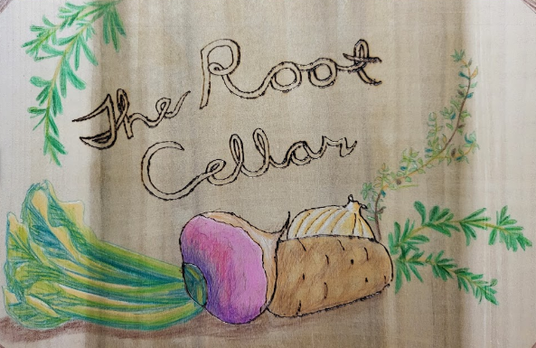

# Welcome

# Bylaws

1. Denizens of the Root Cellar will gather in the hallway on the highest floor of Building 680
2. Every gathering of the Root Cellar will begin with the following toast:
> *"To Denizens of the Cellar past, present and future. May they always remember their roots!"*

3. BYOB
4. BYOF (Bring Your Own Furniture)
5. The resident of Room 2142 is the host and proprietor of the Root Cellar
6. The host and proprieter need not be aware their role or of the Root Cellar's existence
7. Denizens should create a sign and decorate the Cellar as the spirit moves them
8. Denizens are honor-bound to contribute pictures of their efforts on <a href="https://goo.gl/maps/diqp7D8vkK1mAk146">Google Maps</a>

# Bequeathing of the Turnip

Many of the Root Cellar's Denizens are SOS students. At some gathering before the end of a given SOS class, these students should nominate instructors to be honored by the Cellar. The instructor chosen for recognition should be presented with a turnip at the final class of that SOS group. The presenter will say simply: "The Root Cellar recognizes and thanks you." No further explanation is permitted.
